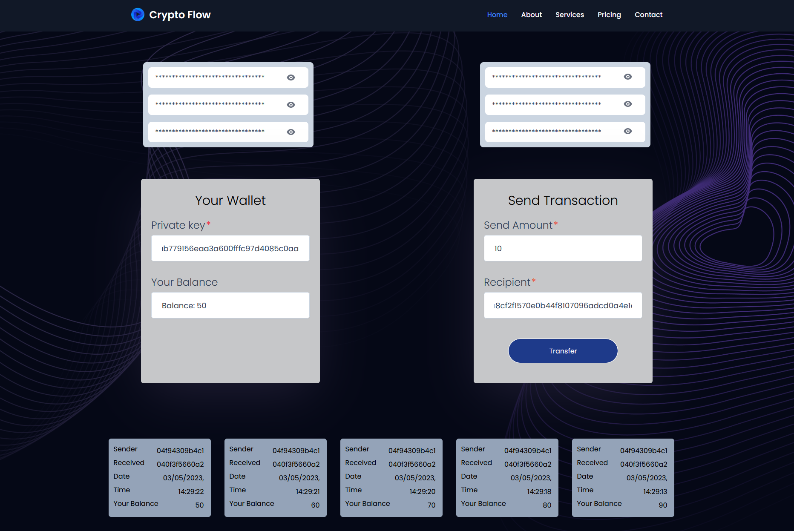

## ECDSA Node

This project is an example of using a client and server to facilitate transfers between different addresses. Since there is just a single server on the back-end handling transfers, this is clearly very centralized. We won't worry about distributed consensus for this project.

However, something that we would like to incoporate is Public Key Cryptography. By using Elliptic Curve Digital Signatures we can make it so the server only allows transfers that have been signed for by the person who owns the associated address.

### Video instructions

For an overview of this project as well as getting started instructions, check out the following video:

https://www.loom.com/share/0d3c74890b8e44a5918c4cacb3f646c4

### Client

The client folder contains a [react app](https://reactjs.org/) using [vite](https://vitejs.dev/). To get started, follow these steps:

1. Open up a terminal in the `/client` folder
2. Run `npm install` to install all the depedencies
3. Run `npm run dev` to start the application
4. Now you should be able to visit the app at http://127.0.0.1:5173/

### Server

The server folder contains a node.js server using [express](https://expressjs.com/). To run the server, follow these steps:

1. Open a terminal within the `/server` folder
2. Run `npm install` to install all the depedencies
3. Run `node index` to start the server

The application should connect to the default server port (3042) automatically!

_Hint_ - Use [nodemon](https://www.npmjs.com/package/nodemon) instead of `node` to automatically restart the server on any changes.

## Summary of my submission and image of UI

### Front-end:

1. Generate a message hash by calling the keccak256() function with the concatenated values of recipient, sendAmount, and nonce, converted to bytes using the utf8ToBytes() function.
2. Use the secp.sign() function to sign the messageHash with the privateKey using the recovery option set to true.
3. Store the signedTransaction variable for use on the back-end.

### Back-end:

1. Retrieve the sender, recipient, amount, nonce, and signTxn values from the req.body.
2. Destructure the signedTransaction variable into signature and recoveryBit variables.
3. Convert the signature to a Uint8Array using the Object.values() and Uint8Array.from() functions.
4. Convert the recipient, amount, and nonce values to bytes using the utf8ToBytes() function and hash the resulting bytes using the keccak256() function, then convert the result to a hexadecimal string using the toHex() function.
5. Recover the public key using the secp.recoverPublicKey() function with the messageHashToHex, unit8ArraySignature, and recoveryBit variables.
6. Verify the transaction using the secp.verify() function with the unit8ArraySignature, messageHashToHex, and publicKey variables.
7. Call the handleTransactionResponse() function with the verifyTransaction, sender, recipient, amount, and res variables.

### User interface

